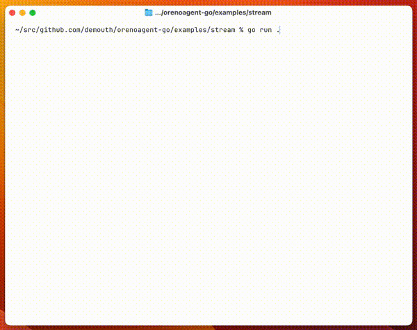

# orenoagent-go

A lightweight AI agent framework built with OpenAI's Reasoning models.

## Demo



## Overview

- Streaming support for real-time reasoning delta updates
- Tool calling and function execution
- Built with OpenAI's Reasoning models (GPT-5)

## Requirements

- Set the `OPENAI_API_KEY` environment variable
- To use reasoning summaries, you need to verify your organization in the OpenAI settings

## Example

```go
package main

import (
    "context"
    "github.com/demouth/orenoagent-go"
    "github.com/openai/openai-go/v3"
)

func main() {
    client := openai.NewClient()
    ctx := context.Background()

    agent := orenoagent.NewAgent(client)
    subscriber, _ := agent.Ask(ctx, "What is the current date and time?")

    for result := range subscriber.Subscribe() {
        switch r := result.(type) {
        case *orenoagent.ErrorResult:
            fmt.Printf("Error: %v\n", r.Error())
            return
        case *orenoagent.MessageResult:
            println(r.String())
        case *orenoagent.ReasoningResult:
            println(r.String())
        case *orenoagent.FunctionCallResult:
            println(r.String())
        }
    }
}
```
